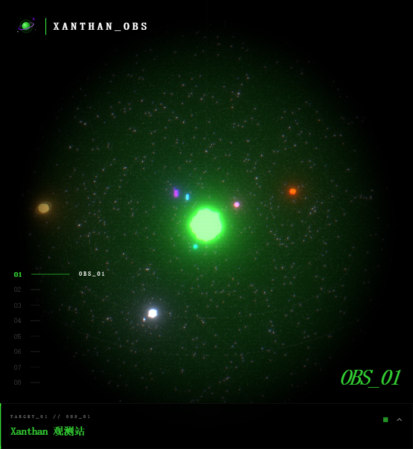

<p align="center">
  
</p>

<h1 align="center">XanthanL | Project Constellation 项目星系</h1>

<p align="center">
  一个 3D 太阳系风格的个人项目导航站——每一颗行星都是一个已部署上线的真实项目，点击行星即可跃迁前往。
</p>

<p align="center">
  <a href="https://www.xanthanl.cc.cd/"><b>🌌 进入观测站 →</b></a>
</p>

<p align="center">
  
</p>

## 🪐 星系成员

| 编号 | 天体 | 项目 | 传送门 |
|:---:|:---:|---|---|
| 01 | ☀️ 恒星 | Xanthan 观测站（本站） | [www.xanthanl.cc.cd](https://www.xanthanl.cc.cd/) |
| 02 | 🟩 立方体 | ASCII LAB 文字工坊 | [ascii-art-two-theta.vercel.app](https://ascii-art-two-theta.vercel.app/) |
| 03 | 💗 二十面体 | 图印工坊 PicMark Studio | [/picmark-studio](https://www.xanthanl.cc.cd/picmark-studio/) |
| 04 | 🔵 环体 | 树言·旅记 | [/shuyan-travel](https://www.xanthanl.cc.cd/shuyan-travel/) |
| 05 | 🟣 环结 | Electric Mirage 专辑 | [/XanthanLMusic](https://www.xanthanl.cc.cd/XanthanLMusic/) |
| 06 | ⚪ 八面体 | ARH 意识形态测试 | [/ARH](https://www.xanthanl.cc.cd/ARH/) |
| 07 | 🟥 十二面体 | GAME LAB 前端游戏实验场 | [/game-lab](https://www.xanthanl.cc.cd/game-lab/) |
| 08 | 🟡 气态巨星 | DIAGONAL 对角线计划 | [diagonal-art.com](https://diagonal-art.com/) |
| 09 | 🟪 雾紫行星 | 弦诵 XianSong（Android 阅读器） | [Releases 下载 APK](https://github.com/XanthanL/XianSong/releases) |

## 🛠️ 技术栈

React 18 · TypeScript · Vite 5 · Three.js（@react-three/fiber + drei + postprocessing）· Tailwind CSS · Framer Motion

## 🚀 本地开发

```bash
npm install        # 安装依赖
npm run dev        # 本地开发（Vite）
npm run build      # 生产构建
npm run icons      # 从 SVG 源文件重新生成 favicon / 分享图
```

新增项目只需在 [`src/data/projects.ts`](src/data/projects.ts) 里加一条记录——形状、颜色、轨道、介绍全部数据驱动。

## 📦 部署

推送到 `main` 分支后由 GitHub Actions 自动构建部署到 GitHub Pages。
